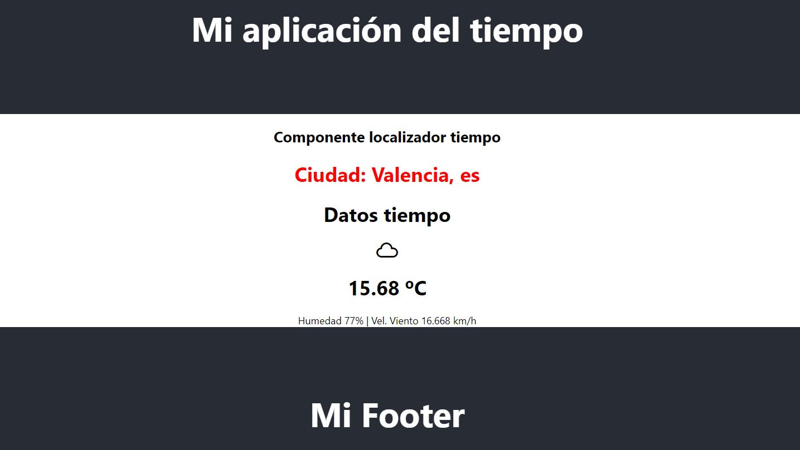

### Weather React App ☁️
Aplicación que muestra el tiempo actual
#### Tecnologías: 📌
React + class components

#### - Instalar dependencias :hammer:
```
yarn install
```


#### - Arranque :key:
```
yarn start
```
Url de acceso: [http://localhost:3000](http://localhost:3000)
####
#### - API consumida :card_index:
[http://api.openweathermap.org](http://api.openweathermap.org)

#### - Captura del proyecto :camera:

